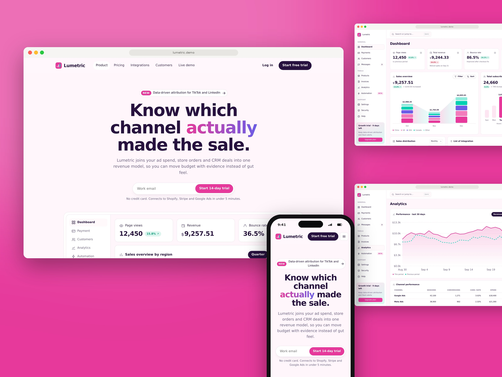
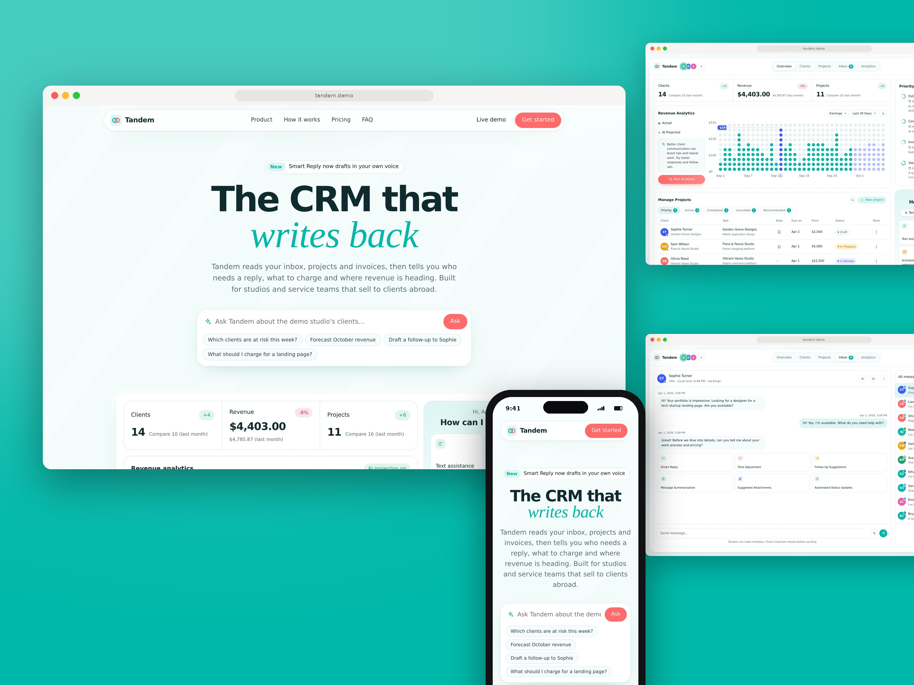
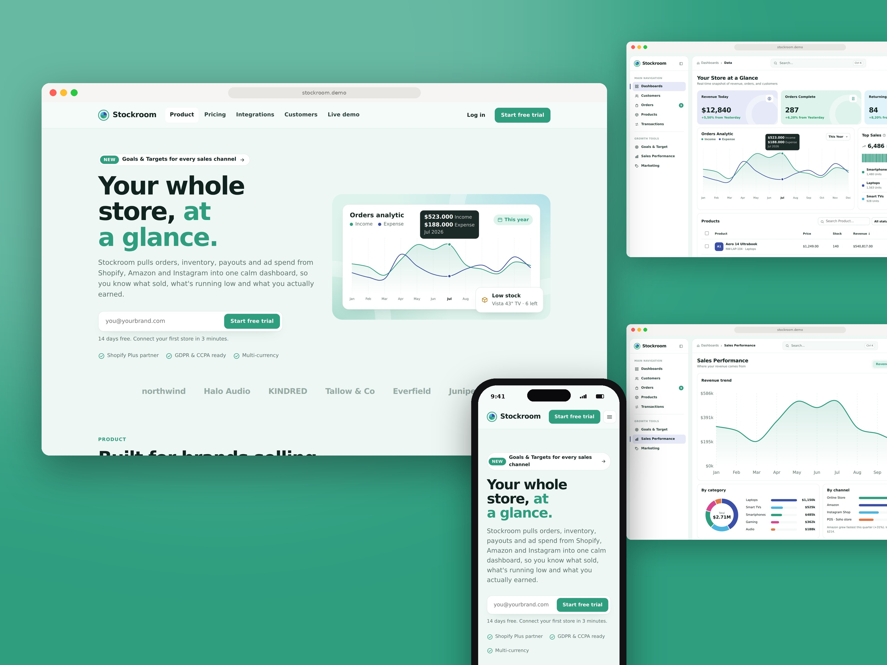
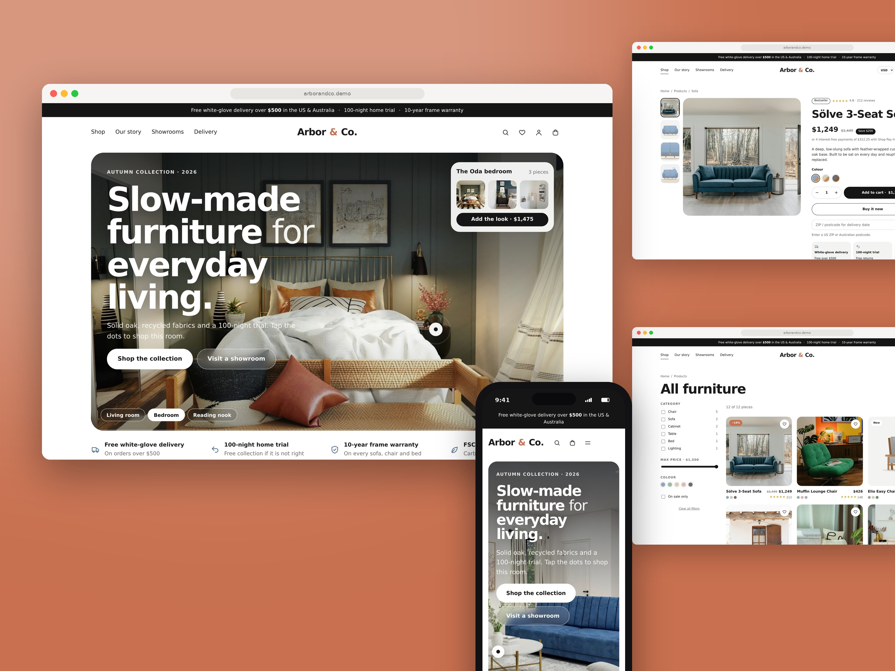
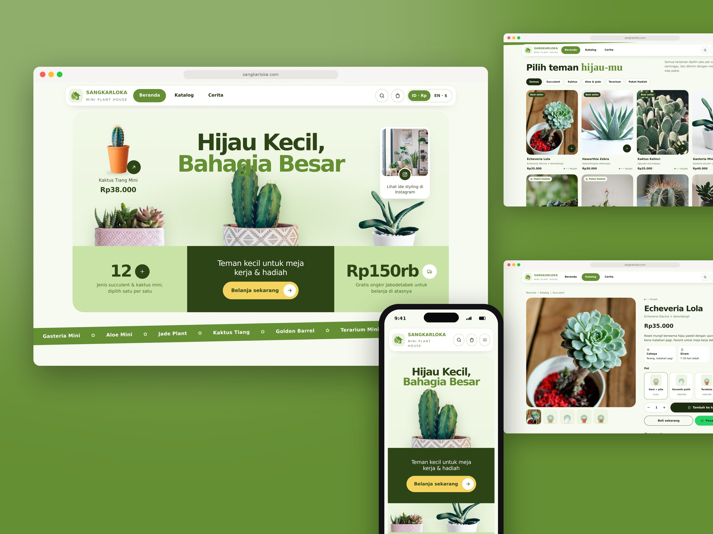
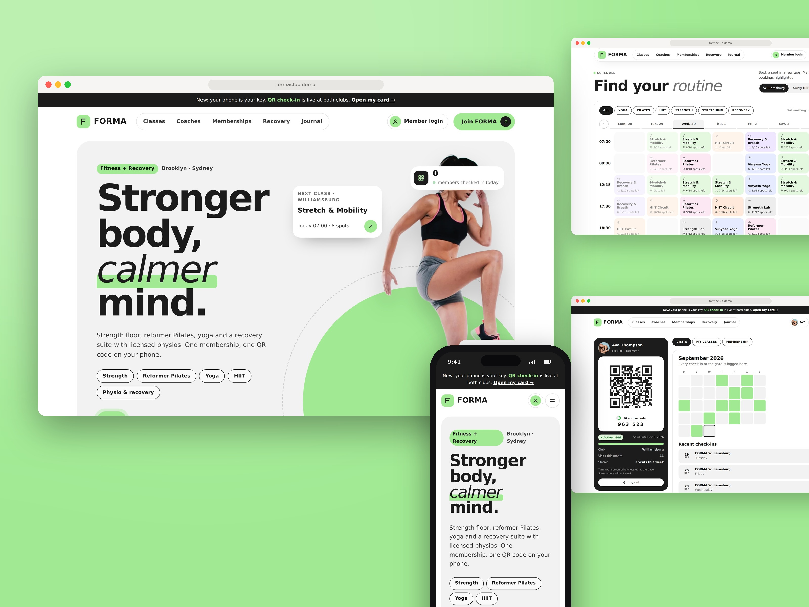
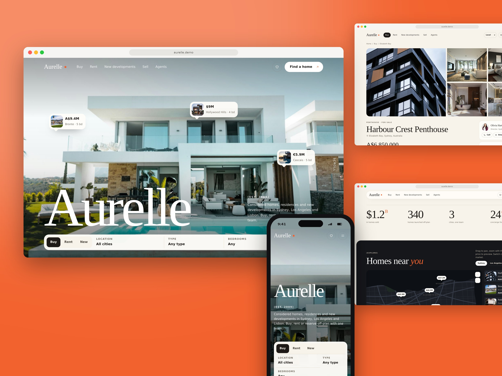
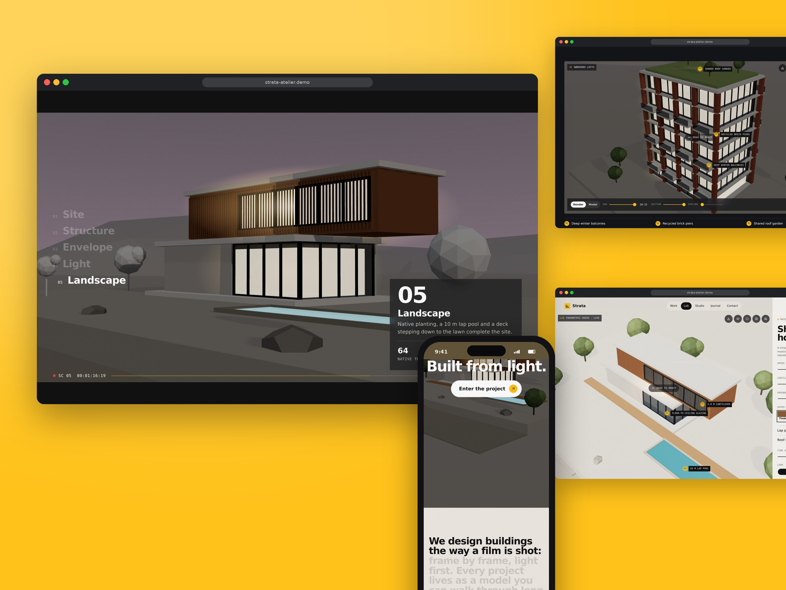

# Dummy-Project

Portfolio demo websites built by Organoo Studio for pitching clients in the US, EU and Australia. Each one is a self-contained static site: open its `index.html`, or serve the folder (for example `npx serve 09-strata-atelier`). Everything runs in the browser, with no backend and no API keys.

This repo is separate from the organoostudio.com site ([Organoo-Redesign](https://github.com/organoostudio/Organoo-Redesign)).

| # | Folder | Category | Brand | Palette |
| --- | --- | --- | --- | --- |
| 01 | [`01-lumetric`](01-lumetric/) | SaaS: marketing analytics | Lumetric | Magenta Burst `#E6399B` |
| 02 | [`02-tandem`](02-tandem/) | AI product: AI-native CRM | Tandem | Friendly Teal `#00B8A9` |
| 03 | [`03-stockroom`](03-stockroom/) | E-commerce SaaS: store analytics & admin | Stockroom | Sea Glass `#2E9E7F` |
| 04 | [`04-arbor-and-co`](04-arbor-and-co/) | E-commerce storefront (Shopify-style) | Arbor & Co. | Neutral + terracotta `#C8704F` |
| 05 | [`05-sangkarloka`](05-sangkarloka/) | E-commerce: mini plants (**real brand**) | Sangkarloka | Logo greens `#658F33` |
| 06 | [`06-halden-and-rowe`](06-halden-and-rowe/) | Professional services: advisory firm | Halden & Rowe | Cobalt Citrus `#2F5BFF` |
| 07 | [`07-forma`](07-forma/) | Healthcare & wellness: gym with QR attendance | FORMA | Ink + lime `#A1EA93` |
| 08 | [`08-aurelle-estates`](08-aurelle-estates/) | Real estate & property development | Aurelle Estates | Ivory & Ember `#F2622E` |
| 09 | [`09-strata-atelier`](09-strata-atelier/) | Architecture / interiors / creative studio (cinematic 3D) | Strata Atelier | Concrete & Signal `#FFC21A` |

## Gallery

| | | |
| --- | --- | --- |
|  |  |  |
| **Lumetric** | **Tandem** | **Stockroom** |
|  |  |  |
| **Arbor & Co.** | **Sangkarloka** | **Halden & Rowe** |
|  |  |  |
| **FORMA** | **Aurelle Estates** | **Strata Atelier** |

## Preview images

Every site has a `preview/` folder with ready-made material for portfolio posts and motion videos:

```
NN-name/preview/
  cover.jpg            # 3200×2400 presentation shot on the brand colour (Dribbble 1600×1200 @2x)
  mockup-laptop.png    # hero on a laptop, transparent background
  desktop/             # 2880×1800 screenshots (1440×900 @2x)
    home-NN.jpg        #   home page, section by section, top to bottom
    page-*.jpg         #   main pages from the navigation (+ "-2" = scrolled)
    x-*.jpg            #   extra pages and states: dashboards (+ dark mode), product pages,
                       #   checkout, member card, admin, 3D viewer states, and so on
  mobile/              # 1170×2532 screenshots (390×844 @3x)
  components/          # UI parts cut out as PNG with transparent corners (cards, panels, widgets)
  video/
    NN-name-home.mp4   # smooth auto-scroll through the home page, cursor visiting each section
    NN-name-tour.mp4   # full walkthrough that clicks through the main features
```

Videos are 1920×1080 H.264 screen recordings (60 fps; Strata Atelier 30 fps because of its WebGL scenes). They were rendered frame by frame, so motion is perfectly smooth with no dropped frames.

The demo badge is hidden in all captures. Photos inside the screenshots are Unsplash stock (see each `CREDITS.txt`).

## Highlights

- **Lumetric, Tandem, Stockroom:** landing page plus a full dashboard app (hash routing, demo data, pricing calculators). Tandem's AI features are rule-based and run on the demo data.
- **Arbor & Co.:** editorial storefront with shop-the-look hero, shop filters, product pages, cart, discount codes and 3-step checkout.
- **Sangkarloka:** Organoo's own plant shop in Bahasa Indonesia (EN toggle), plant-shelf hero with cut-out plants, sentence-builder plant match, checkout with JNE/SiCepat/GoSend and BCA VA/QRIS/COD. No fabricated reviews.
- **Halden & Rowe:** heavy scroll motion (pinned horizontal services, stacking cards, word fill), planning calculator, and a consultation booking wizard with time zones.
- **FORMA:** daily QR check-in with anti-fraud rules (rotating 30-second codes, screenshot and card-sharing detection, off-peak and expiry checks), a front-desk scanner, and an admin with CSV export. The QR encoder is hand-written (`js/qr.js`).
- **Aurelle Estates:** listings with filters, grid/split/map views, compare, property pages with floor plan, mortgage calculator and viewing booking, off-plan unit reservations, and an instant valuation.
- **Strata Atelier:** procedural three.js architecture. A scroll-driven film builds a house from sketch to lit dusk. Six live 3D models with sun study, section cut, exploded floors and PNG stills, plus a parametric Massing Lab.

## Folder layout

```
NN-name/
  index.html      # page structure (open this)
  css/style.css   # all styling
  js/             # all scripts
  photos/         # Unsplash stock photos (sites 04–09)
  CREDITS.txt     # photo sources and notes (sites 04–09)
  preview/        # cover, laptop mockup, screenshots and screen-recording videos
```

JavaScript files per site:

| Site | `js/` |
| --- | --- |
| 01–03, 06, 08 | `app.js` |
| 04 Arbor & Co., 05 Sangkarloka | `art.js` (SVG illustrations) + `app.js` |
| 07 FORMA | `qr.js` (hand-written QR encoder) + `app.js` |
| 09 Strata Atelier | `engine.js` (three.js 3D engine) + `app.js` |

Scripts are plain classic scripts loaded in order at the end of `<body>`, with no build step. Sites 01–03 keep one inline line in `<head>` that forces the light theme before first paint, and Strata keeps its import map inline because browsers require it in the page.

## Notes

- **Content:** brands, people, prices and figures are fictional (except Sangkarloka). Each fictional site shows a "Demo · Organoo Studio" badge. People photos are stock models.
- **Photos:** Unsplash, under the [Unsplash License](https://unsplash.com/license); sources are in each `CREDITS.txt`.
- **External loads:** Google Fonts on every site. Strata also loads three.js r160 (MIT) from cdn.jsdelivr.net, so it needs an internet connection; without WebGL it falls back to photos.
- **Design notes:** the full brief, palettes and feature list for every demo is in [`MOODBOARD.md`](MOODBOARD.md).
